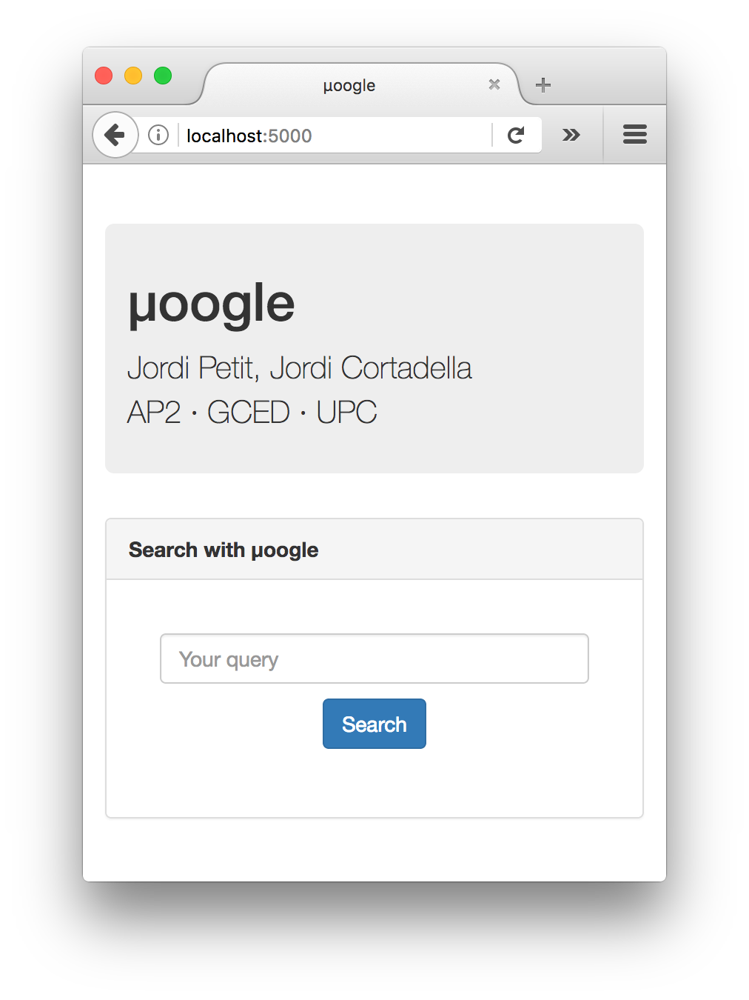
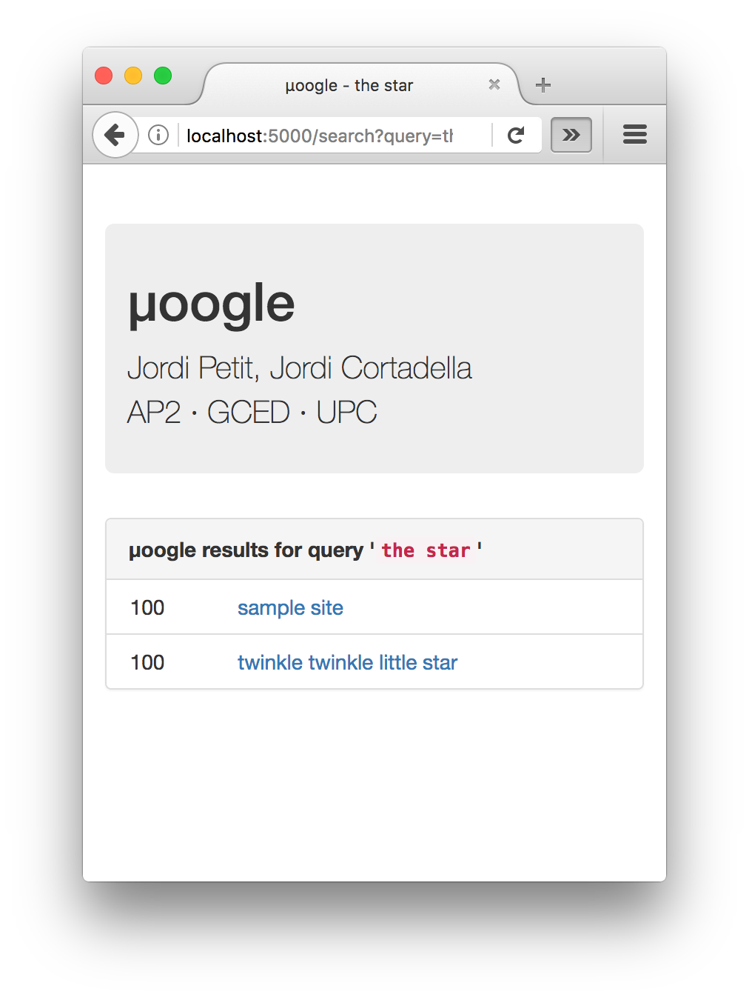
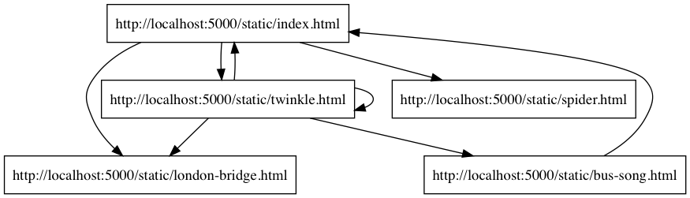

# µoogle

The µoogle project for GCED-AP2 (2018 edition)


# Documentation

This page describes the µoogle project for the AP2 course at GCED. µoogle stands for
"micro Google" and your task is to implement the core of a simple system to
crawl web pages and answer queries from users, by reporting which pages
contain all the words they search.


## Demo

This screenshot shows the home page of the web server:



Looks familiar?

This screenshot shows the results of quering for `the star`:




## Architecture

The architecture of the system is as follows:

-   The `server.py` module is the web server that users will use
    in order to get answers to their queries.

    In order to start the web server, simply run `./server.py`.
    Or use the `--help` flag to get more options.

    You can interact with
    the web server by opening the `http://localhost:5000` URL in your
    browser.

    Additionally, the web server also offers some sample files
    under the `static` directory. Point your bowser to
    `http://localhost:5000/static/index.html` to browse their root.
    This figure shows the relations between these
    pages:

    

    The `server.py` module is already implemented, **do not modify it**.

-   The `answer.py` module is a command line interface tool that
    developpers can use in order to get answers to their queries.
    For instance, `./answer.py -q "the star"` will deliver the indexed web
    pages that match the query:

    ```text
    [{'score': 100,
      'title': 'sample site',
      'url': 'http://localhost:5000/static/index.html'},
     {'score': 100,
      'title': 'twinkle twinkle little star',
      'url': 'http://localhost:5000/static/twinkle.html'}]
    ```

    Use `./answer.py --help` to get more options.

    This module is already implemented, **do not modify it**.

-   The `crawler.py` module is the command line interface tool that
    is used to crawl the web and index its pages. In order to
    execute it, use a command such as `./crawler.py --url http://localhost:5000/static/index.html`, which specifies its starting page.
    Use `./crawler.py --help` to get more options.

    This module is already implemented, **do not modify it**.

-   The `util.py` module contains several utility functions that are used
    in the other modules.

    This module is already implemented, **do not modify it**.

-   Finally, the `moogle.py` module contains the core of the application
    and is used by `server.py`, `answer.py` and `crawler.py`, which are
    simple wrappers arround it.
    **This is the only module you have to modify.**


## System overview

The system works in two phases:

1.  In the first phase, the crawler visits some web pages and saves some
    information about them. This information is a Python object referred as the
    _database_ and is referred as `db` all through the project. By default, the
    database is saved in the `moogle.dat` file, but this file can be changed using
    the `--database` flag of the`server.py`, `answer.py` and `crawler.py`
    modules.


2.  In the second phase, the web server loads the database and
    processes queries from users. Alternatively, the queries can
    be processed by the `answer.py` module, which is more useful in order to
    debug.


## Your task

Your task is to implement the `moogle.py` module, so that all the project will
work as expected. In order to do so, you may modify this module at will, but
you have to implement a few functions with a given interface that is described
below. The `moogle.py` module has three parts:


### Common part

This part is meant to define all the types and functions you need.

It also must define an `authors()` function that returns a string with the
names or name of the authors of the assigment. This information is displayed
in the home page. Simply modify this function to include *your* name(s)!


### Crawler part

This part is meant to define all the types and functions you need in order to
perform the crawling phase.

It must define a function `crawler(url, maxdist)`
that crawls the web starting from `url`, following up to `maxdist` links and
returns a database (it is up to you to define the type and value
of this database).

This part already defines a `store(db, filename)` function that
writes a database `db` in file `filename` using `pickle`.


### Answer part

This part is meant to define all the types and functions you need in order to
perform the answer phase.

You should implement the `answer(db, query)` function, that, given a database
and a query (that is, a string of cleaned words), returns a list of pages for
the given query. In this list, each page is a map with three fields:

- `title`: its title
- `url`: its url
- `score`: its score

The list must be sorted by score in descending order. The score of a page is
a real number that describes how relevant is that page for that
query. Higher scores imply more relevance and will be shown first.
Scoring pages **is not** mandatory (it is an extra). You can simply return
all the pages with the same score.

The `answer.py` module just prettifies this result and outputs it.

This part already defines a `load(filename)` function that
reads a database stored in file `filename` using `pickle` and returns it.


## The utility module

The `util.py` module contains two functions that will help you treating
words in web pages.

The `clean_word` function returns (in lowercase) the longest prefix of a word
made of latin unicode characters. This function gives the opportunity to
"normalize" words with latin letters. Here are some examples:

```python
clean_word("Jordi") -> "jordi"
clean_word("Jordi!") -> "jordi"
clean_word("LlorençGabarróNúñezÅrmstrong<>lala") -> "llorençgabarrónúñezårmstrong"
clean_word("AlfaBetaAlefChinaαßℵ中xyz") -> "alfabetaalefchina"
```

The `clean_words` function works all the same, but applied to a string
that can have many words. Here are some examples:


```python
clean_words("Jordi") -> "jordi"
clean_words("Jordi Jordi!    Llorenç#Martí") -> "jordi jordi llorenç"
```


# Usefull information

The following code snippet reads a page through its url and prints its title,
text and all its links. Error handling has been ommitted.

```python
import urllib.request
from bs4 import BeautifulSoup

url = "http://localhost:5000/static/index.html"
response = urllib.request.urlopen(url)
page = response.read()
soup = BeautifulSoup(page, "html.parser")
print(soup.title.string)
print(soup.get_text())
for link in soup.find_all("a"):
    print(link.get("href"), link.string)
```

The following code snippet show how to save some data
(whatever its type) into a file
so that it can be retrieved latter:

```python
import pickle

data = {1:2, 2:3}
f = open("somefile.dat", "wb")
pickle.dump(data, f)
f.close()
```

And this code shows how to retrieve it back:

```python
import pickle

f = open("somefile.dat", "rb")
data = pickle.load(f)
f.close()
```

# Install dependencies

In order to install the Python libraries you need, please run this command:

```
pip3 install -r requirements.txt
```


# Instruccions

Podeu fer aquest projecte sols o en equips de dos. En cas de fer-lo en equip,
la càrrega de treball dels dos membres de l'equip ha de ser semblant i el
resultat final és responsabilitat d'ambdós. Cada membre de l'equip ha de saber
què ha fet l'altre membre.


## Lliurament

Heu de lliurar la vostra pràctica per correu electrònic al professor Jordi
Petit des del vostre compte oficial. El missatge ha de tenir el Tema
(*Subject*) `Lliurament moogle` i ha de contenir un arxiu ZIP amb tots els
fitxers per fer funcionar la pràctica. El ZIP ha d'incloure un fitxer
`README.md` amb tota la vostra documentació  (disseny, extres, instruccions,
exemples...) en format
[Markdown](https://github.com/adam-p/markdown-here/wiki/Markdown-Cheatsheet).

El termini de lliurament és fins al dilluns 11 de juny a les 8 del matí
(2018-06-11 08:00 CEST).


## Consells

- Si voleu fer parts addicionals extres per pujar la nota ho podeu fer,
però us recomanem de parlar-les abans amb els vostres professors.

- Segurament no us cal definir classes pròpies. Amb
tuples, llistes, diccionaris i conjunts n'hauríeu de tenir prou.

- Si voleu fer servir algun mòdul "exòtic", consulteu-ho abans amb els
vostres professors.

